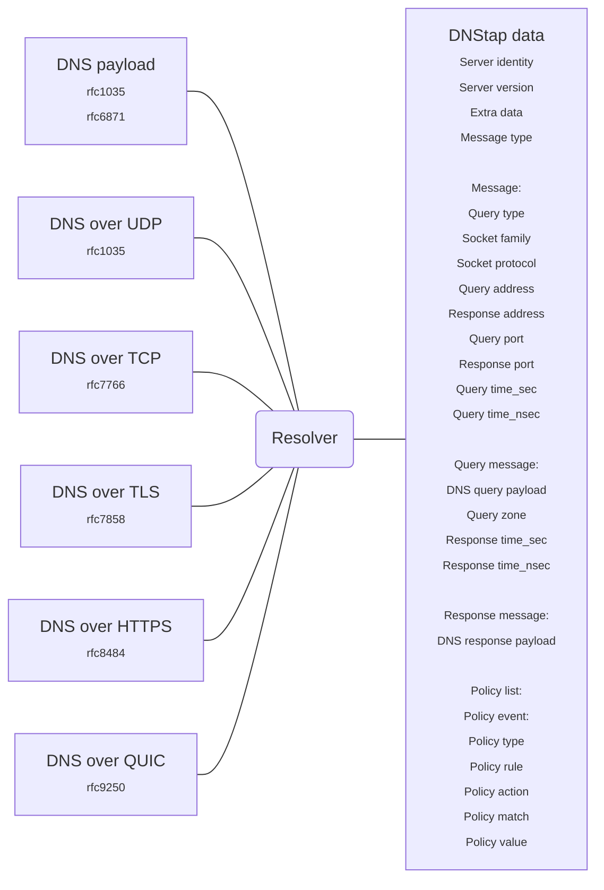

```mermaid

%%{
  init: {
  "theme": "dark",
  "themeVariables": {
    "fontFamily": "monospace"
  }
}%%

flowchart LR
    A[DNS payload 
    <span style="font-size:11px;">rfc1035
    rfc6871</span>
] --- R(Resolver)
    B[DNS over UDP
    <span style="font-size:11px;">rfc1035
    </span>] --- R
    C[DNS over TCP
    <span style="font-size:11px;">rfc7766
    </span>] --- R
    D[DNS over TLS
    <span style="font-size:11px;">rfc7858
    </span>] --- R
    E[DNS over HTTPS
    <span style="font-size:11px;">rfc8484
    </span>] --- R
    F[DNS over QUIC
    <span style="font-size:11px;">rfc9250
    </span>] --- R
  R --- T[DNStap data 
    <span style="font-size:11px;">Server identity
    Server version
    Extra data
    Message type

    Message:
      Query type
      Socket family
      Socket protocol
      Query address
      Response address
      Query port
      Response port
      Query time_sec
      Query time_nsec

Query message:
DNS query payload
Query zone
Response time_sec
Response time_nsec

Response message:
DNS response payload

Policy list:
Policy event:
Policy type
Policy rule
Policy action
Policy match
Policy value
</span>]
```
