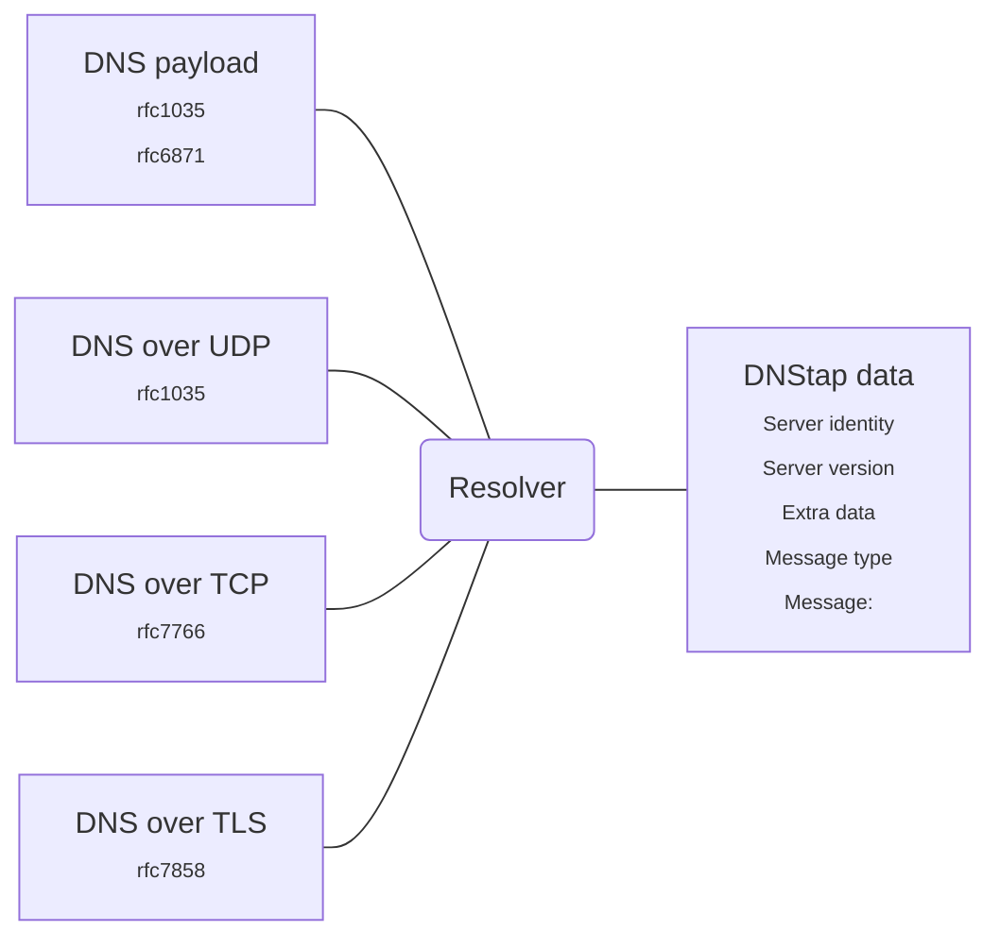

```mermaid

%%{
  init: {
  "theme": "dark",
  "themeVariables": {
    "fontFamily": "monospace"
  }
}%%

flowchart LR
    A[DNS payload 
    <span style="font-size:11px;">rfc1035
    rfc6871</span>
] --- R(Resolver)
    B[DNS over UDP
    <span style="font-size:11px;">rfc1035
    </span>] --- R
    C[DNS over TCP
    <span style="font-size:11px;">rfc7766
    </span>] --- R
    D[DNS over TLS
    <span style="font-size:11px;">rfc7858
    </span>] --- R
  R --- T[DNStap data 
    <span style="font-size:11px;">Server identity
Server version
Extra data
Message type
Message:</span>]
```
