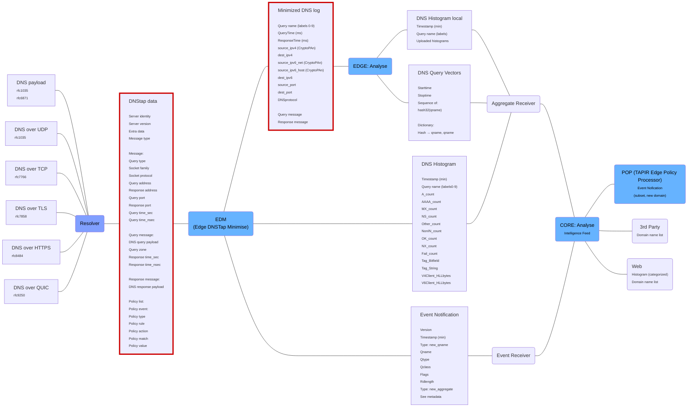

```mermaid

%%{
  init: {
  "themeVariables": {
    "fontFamily": "monospace"
  }
}%%

flowchart LR
    A[DNS payload 
    <span style="font-size:11px;text-align:left;">rfc1035
    rfc6871</span>]:::nodebase --- R(Resolver)
    B[DNS over UDP
    <span style="font-size:11px;">rfc1035
    </span>]:::nodebase --- R
    C[DNS over TCP
    <span style="font-size:11px;">rfc7766
    </span>]:::nodebase --- R
    D[DNS over TLS
    <span style="font-size:11px;">rfc7858
    </span>]:::nodebase --- R
    E[DNS over HTTPS
    <span style="font-size:11px;">rfc8484
    </span>]:::nodebase --- R
    F[DNS over QUIC
    <span style="font-size:11px;">rfc9250
    </span>]:::nodebase --- R
  R:::service_other --- T[DNStap data

    <span style="font-size:11px;">Server identity
    Server version
    Extra data
    Message type

    Message:
      Query type
      Socket family
      Socket protocol
      Query address
      Response address
      Query port
      Response port
      Query time_sec
      Query time_nsec

Query message:
DNS query payload
Query zone
Response time_sec
Response time_nsec

Response message:
DNS response payload

Policy list:
Policy event:
Policy type
Policy rule
Policy action
Policy match
Policy value
</span>]:::sensitive

EDM --- Event["Event Notification

<span style='font-size:11px;'>Version
Timestamp (min)
Type: new_qname
Qname
Qtype
Qclass
Flags
Rdlength
Type: new_aggregate
See metadata</span>
"]:::nodebase

T --- EDM("EDM 
(Edge DNSTap Minimise)"):::service

EDM --- Hist["DNS Histogram
<span style='font-size:11px;'>
Timestamp (min)
Query name (labels0-9)
A_count
AAAA_count
MX_count
NS_count
Other_count
NonIN_count
OK_count
NX_count
Fail_count
Tag_Bitfield
Tag_String
V4Client_HLLbytes
V6Client_HLLbytes</span>
"]:::nodebase

EDM --- Mini["Minimized DNS log

<span style='font-size:11px;'>Query name (labels 0-9)
QueryTime (ms)
ResponseTime (ms)
source_ipv4 (CryptoPAn)
dest_ipv4
source_ipv6_net (CryptoPAn)
source_ipv6_host (CryptoPAn)
dest_ipv6
source_port
dest_port
DNSprotocol

Query message
Response message</span>"]:::sensitive

Mini --- L(EDGE: Analyse):::service 

L --- HL["DNS Histogram local
<span style='font-size:11px;'>Timestamp (min)
Query name (labels)
Uploaded histograms"]:::nodebase

L --- QV["DNS Query Vectors
<span style='font-size:11px;'>
Starttime
Stoptime
Sequence of:
hash32(qname)

Dictionary:
Hash → qname, qname"
]:::nodebase
HL --- AF(Aggregate Receiver)
QV --- AF
Hist --- AF
AF --- Gb(CORE: Analyse
<span style='font-size:11px;'>Intelligence Feed</span>):::service 
Event --- Er(Event Receiver)
Er --- Gb

Gb --- Pop("POP (TAPIR Edge Policy Processor)
<span style='font-size:11px;'>Event Nofication
(subset, new domain)"</span>):::service 

Gb --- 3p(3rd Party
<span style='font-size:11px;'>Domain name list</span>):::greyed

Gb --- W("Web
<span style='font-size:11px;'>Histogram (categorized)
Domain name list"</span>):::nodebase

classDef service fill:#66b3ff,color:#000
classDef nodebase text-align:left;
classDef sensitive text-align:left,stroke:#c00,stroke-width:4px;
classDef service_other fill:#809fff,color:#000

```
